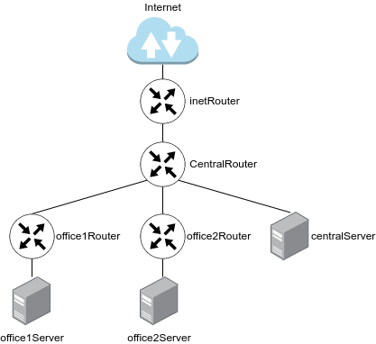
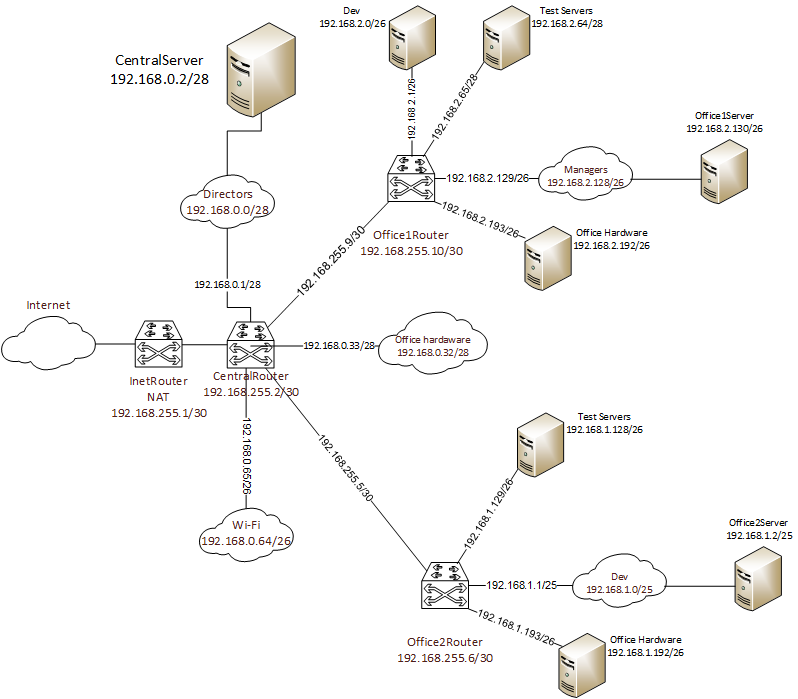

# Домашнее задание Архитектура сетей

## Цель домашнего задания  
Научится менять базовые сетевые настройки в Linux-based системах.

### Описание домашнего задания  

1. Скачать и развернуть Vagrant-стенд https://github.com/erlong15/otus-linux/tree/network   
2. Построить следующую сетевую архитектуру:   
Сеть office1   
- 192.168.2.0/26      - dev   
- 192.168.2.64/26     - test servers    
- 192.168.2.128/26    - managers   
- 192.168.2.192/26    - office hardware    

Сеть office2   
- 192.168.1.0/25      - dev   
- 192.168.1.128/26    - test servers   
- 192.168.1.192/26    - office hardware   

Сеть central   
- 192.168.0.0/28     - directors   
- 192.168.0.32/28    - office hardware   
- 192.168.0.64/26    - wifi   

    

Итого должны получиться следующие сервера:   
inetRouter    
centralRouter   
office1Router    
office2Router    
centralServer   
office1Server    
office2Server    

Задание состоит из 2-х частей: теоретической и практической.   
В теоретической части требуется:    
- Найти свободные подсети    
- Посчитать количество узлов в каждой подсети, включая свободные    
- Указать Broadcast-адрес для каждой подсети    
- Проверить, нет ли ошибок при разбиении    

В практической части требуется:    
- Соединить офисы в сеть согласно логической схеме и настроить роутинг   
- Интернет-трафик со всех серверов должен ходить через inetRouter   
- Все сервера должны видеть друг друга (должен проходить ping)   
- У всех новых серверов отключить дефолт на NAT (eth0), который vagrant поднимает для связи   
- Добавить дополнительные сетевые интерфейсы, если потребуется   


Формат сдачи ДЗ - vagrant + ansible
   
# Введение   
Сеть — очень важная составляющая в работе серверов. По сети сервера взаимодействуют между собой.   
В данном домашнем задании мы рассмотрим технологии маршрутизации и NAT.   
Маршрутизация — выбор оптимального пути передачи пакетов. Для маршрутизации используется таблица маршрутизации.    
Основная задача маршрутизации — доставить пакет по указанному IP-адресу.     
Если одно устройство имеет сразу несколько подсетей, например в сервере есть 2 порта с адресами:   
1. 192.168.1.10/24   
2. 10.10.12.72/24   
то, такие сети называются непосредственно подключенными (Directly connected networks). Маршрутизация между Directly Connected сетями происходит автоматически. Дополнительная настройка не требуется.    
Если необходимая сеть удалена, маршрутизатор будет искать через какой порт она будет доступна, если такой порт не найден, то трафик уйдет на шлюз по умолчанию.     
Маршрутизация бывает статическая и динамическая.    
При использовании статической маршрутизации администратор сам создает правила для маршрутов. Плюсом данного метода является безопасность, так как статические маршруты не обновляются по сети, а минусом — сложности при работе с сетями больших объёмов…    
Динамическая маршрутизация подразумевает автоматическое построение маршрутов с помощью различных протоколов (RIP,OSPF,BGP, и.т.д.).   
Маршрутизаторы сами обмениваются друг с другом информацией о сетях и автоматически прописывают маршруты.    
NAT — это процесс, используемый для преобразования сетевых адресов.    
Основные цели NAT:   
- Экономия публичных IPv4-адресов    
- Повышение степени конфиденциальности и безопасности сети.    
NAT обычно работает на границе, где локальная сеть соединяется с сетью Интернет. Когда устройству сети потребуется подключение к устройству вне его сети (например в Интернете), пакет пересылается маршрутизатору с NAT, а маршрутизатор преобразовывает его внутренний адрес в публичный.   


# Выполнение:  

### 1. Теоритическая часть
Исходя из заданой сетевой адресации, построил таблицу:
  
<table>
  <tr>
    <th>Название</th>
    <th>Подсеть</th>
    <th>Маска</th>
    <th>Количество хостов</th>
    <th>Начальный адрес</th>
    <th>Последний адрес</th>
    <th>Broadcast</th>
  </tr>
  <tr>
    <th colspan="7">Сеть Central</th>
  </tr>
  <tr>
    <th>Directors</th>
    <td>192.168.0.0/28</td>
    <td>255.255.255.240</td>
    <td>14</td>
    <td>192.168.0.1</td>
    <td>192.168.0.14</td>
    <td>192.168.0.15</td>
  </tr>
  <tr>
    <th>Office Hardware</th>
    <td>192.168.0.32/28</td>
    <td>255.255.255.240</td>
    <td>14</td>
    <td>192.168.0.33</td>
    <td>192.168.0.46</td>
    <td>192.168.0.47</td>
  </tr>
  <tr>
    <th>Wi-Fi</th>
    <td>192.168.0.64/26</td>
    <td>255.255.255.192</td>
    <td>62</td>
    <td>192.168.0.65</td>
    <td>192.168.0.126</td>
    <td>192.168.0.127</td>
  </tr>
  <tr>
    <th colspan="7">Сеть Office1</th>
  </tr>
  <tr>
    <th>Dev</th>
    <td>192.168.2.0/26</td>
    <td>255.255.255.192</td>
    <td>62</td>
    <td>192.168.0.1</td>
    <td>192.168.0.62</td>
    <td>192.168.0.63</td>
  </tr>
  <tr>
    <th>Test Servers</th>
    <td>192.168.2.64/26</td>
    <td>255.255.255.192</td>
    <td>62</td>
    <td>192.168.0.65</td>
    <td>192.168.0.126</td>
    <td>192.168.0.127</td>
  </tr>
  <tr>
    <th>Managers</th>
    <td>192.168.2.128/26</td>
    <td>255.255.255.192</td>
    <td>62</td>
    <td>192.168.0.129</td>
    <td>192.168.0.190</td>
    <td>192.168.0.191</td>
  </tr>
   <tr>
    <th>Office Hardware</th>
    <td>192.168.2.192/26</td>
    <td>255.255.255.192</td>
    <td>62</td>
    <td>192.168.0.193</td>
    <td>192.168.0.254</td>
    <td>192.168.0.255</td>
  </tr> 
  <tr>
    <th colspan="7">Сеть Office2</th>
  </tr>
  <tr>
    <th>Dev</th>
    <td>192.168.1.0/25</td>
    <td>255.255.255.128</td>
    <td>126</td>
    <td>192.168.1.1</td>
    <td>192.168.1.126</td>
    <td>192.168.1.127</td>
  </tr>
  <tr>
    <th>Test Servers</th>
    <td>192.168.1.128/26</td>
    <td>255.255.255.192</td>
    <td>62</td>
    <td>192.168.1.129</td>
    <td>192.168.1.190</td>
    <td>192.168.1.191</td>
  </tr>
   <tr>
    <th>Office Hardware</th>
    <td>192.168.1.192/26</td>
    <td>255.255.255.192</td>
    <td>62</td>
    <td>192.168.1.193</td>
    <td>192.168.1.254</td>
    <td>192.168.1.255</td>
  </tr> 
  <tr>
    <th colspan="7">Сеть CentralRouter-InetRouter</th>
  </tr>
  <tr>
    <th>Central-Inet</th>
    <td>192.168.255.0/30</td>
    <td>255.255.255.252</td>
    <td>2</td>
    <td>192.168.255.1</td>
    <td>192.168.255.2</td>
    <td>192.168.1.3</td>
  </tr>
</table>

Определил свободные подсети в используемых диапазонах:
  
<table>
<th colspan="7">Свободные подсети</th>
  <tr>
    <th>Подсеть</th>
    <th>Маска</th>
    <th>Количество хостов</th>
    <th>Начальный адрес</th>
    <th>Последний адрес</th>
    <th>Broadcast</th>
  </tr>
  <tr>
    <td>192.168.0.16/28</td>
    <td>255.255.255.240</td>
    <td>14</td>
    <td>192.168.0.17</td>
    <td>192.168.0.30</td>
    <td>192.168.0.31</td>
  </tr>
  <tr>
    <td>192.168.0.48/28</td>
    <td>255.255.255.240</td>
    <td>14</td>
    <td>192.168.0.17</td>
    <td>192.168.0.62</td>
    <td>192.168.0.63</td>
  </tr>  
    <tr>
    <td>192.168.0.128/25</td>
    <td>255.255.255.128</td>
    <td>126</td>
    <td>192.168.0.129</td>
    <td>192.168.0.254</td>
    <td>192.168.0.255</td>
  </tr>
  <tr>
    <td>192.168.255.4/30</td>
    <td>255.255.255.252</td>
    <td>2</td>
    <td>192.168.255.5</td>
    <td>192.168.255.6</td>
    <td>192.168.255.7</td>
  </tr>  
  <tr>
    <td>192.168.255.8/29</td>
    <td>255.255.255.248</td>
    <td>6</td>
    <td>192.168.255.9</td>
    <td>192.168.255.14</td>
    <td>192.168.255.15</td>
  </tr>  
  <tr>
    <td>192.168.255.16/28</td>
    <td>255.255.255.240</td>
    <td>14</td>
    <td>192.168.255.17</td>
    <td>192.168.255.30</td>
    <td>192.168.255.31</td>
  </tr>  
  <tr>
    <td>192.168.255.32/27</td>
    <td>255.255.255.224</td>
    <td>30</td>
    <td>192.168.255.33</td>
    <td>192.168.255.62</td>
    <td>192.168.255.63</td>
  </tr>  
  <tr>
    <td>192.168.255.64/26</td>
    <td>255.255.255.192</td>
    <td>62</td>
    <td>192.168.255.65</td>
    <td>192.168.255.126</td>
    <td>192.168.255.127</td>
  </tr>  
  <tr>
    <td>192.168.255.128/25</td>
    <td>255.255.255.128</td>
    <td>126</td>
    <td>192.168.255.129</td>
    <td>192.168.255.254</td>
    <td>192.168.255.255</td>
  </tr>  
</table>

### 2. Практическая часть   
Карта сети. Выделил из свободного диапозона 2 подсети по 30 маске для соединения CentralRouter и Office1Router, а также CentralRouter и Office2Router:   

   

На основании схемы построил таблицу адресации серверов:
<table>
  <tr>
    <th>Название</th>
    <th>IP-адрес</th>
    <th>С чем соединен интерфейс</th>
  </tr>
  <tr>
    <th rowspan="2">InetRouter</th>
    <td>VirtualBox NAT Network</td>
    <td>VirtualBox Host</td>
  </tr>
  <tr>
    <td>192.168.255.1/30</td>
    <td>CentralRouter</td>
  </tr>  
    <tr>
    <th rowspan="6">CentralRouter</th>
    <td>192.168.255.2/30</td>
    <td>InetRouter</td>
  </tr>
  <tr>
    <td>192.168.0.1/28</td>
    <td>CentralServer</td>
  </tr>  
  <tr>
    <td>192.168.0.33/28</td>
    <td>Подсеть Office Hardware</td>
  </tr>  
   <tr>
    <td>192.168.0.65/26</td>
     <td>Подсеть Wi-Fi</td>
  </tr>
  <tr>
    <td>192.168.255.5/30</td>
     <td>Office2Router</td>
  </tr>
  <tr>
    <td>192.168.255.9/30</td>
     <td>Office1Router</td>
  </tr>
  <tr>
    <th rowspan="5">Office1Router</th>
    <td>192.168.2.1/26</td>
    <td>Подсеть Dev</td>
  </tr>
  <tr>
    <td>192.168.2.65/28</td>
    <td>Подсеть Test Servers</td>
  </tr>
  <tr>
    <td>192.168.2.129/26</td>
    <td>Office1Server</td>
  </tr>
  <tr>
    <td>192.168.2.192/26</td>
    <td>Подсеть Office Hardware</td>
  </tr>
  <tr>
    <td>192.168.255.10/30</td>
     <td>CentralRouter</td>
  </tr>
  <tr>
    <th rowspan="4">Office2Router</th>
    <td>192.168.1.1/25</td>
    <td>Office2Server</td>
  </tr>
  <tr>
    <td>192.168.1.129/26</td>
    <td>Подсеть Test Servers</td>
  </tr>
  <tr>
    <td>192.168.1.192/26</td>
    <td>Подсеть Office Hardware</td>
  </tr>
  <tr>
    <td>192.168.255.6/30</td>
     <td>CentralRouter</td>
  </tr>
  <tr>
    <th>CentralServer</th>
    <td>192.168.0.2/28</td>
    <td>CentralRouter</td>
  </tr>
  <tr>
    <th>Office1Server</th>
    <td>192.168.2.130/26</td>
    <td>Office1Router</td>
  </tr>
  <tr>
    <th>Office2Server</th>
    <td>192.168.1.2/25</td>
    <td>Office2Router</td>
  </tr>
</table>  


## 2.1 Далее доплнил Vagranfile предложенный в методичке, создал пудличный ssh ключ, скопировал его в рабочую папку проекта, где находится Vagranfile и выполнил команду vagrant up   
*данную работу выполнял в среде Windows+Vagrant, из-за provision ansible пришлось раскатывать дополнительную ВМ специально для ansible. Другие способы не помогли или не было возможности их реализовать. Поэтому запуск плэйбука будет происходить с этой доп. машины, предварительно загрузив в нее рабочий проект ДЗ*
  
```shell
PS F:\VM\Vagrant\DZ\NET\vagrant> vagrant up
Bringing machine 'inetRouter' up with 'virtualbox' provider...
Bringing machine 'centralRouter' up with 'virtualbox' provider...
Bringing machine 'centralServer' up with 'virtualbox' provider...
Bringing machine 'office1Router' up with 'virtualbox' provider...
Bringing machine 'office1Server' up with 'virtualbox' provider...
Bringing machine 'office2Router' up with 'virtualbox' provider...
Bringing machine 'office2Server' up with 'virtualbox' provider...
Bringing machine 'ansible' up with 'virtualbox' provider...
```   

## 2.2 Написал Playbook network.yml и создал роль network 

```yml
---
- name: configure logging
  hosts: all
  become: true
  roles:
    - network

```   

#### 2.2 Подключился к каждой ВМ по ssh и настроил сервера вручную. На всех серверах, кроме inetRouter, удалил маршрут по умолчанию который Vagrant создает по умолчанию. Для этого изменил файл /etc/netplan/00-installer-config.yaml
```shell
network:
  ethernets:
    eth0:
      dhcp4: true
      dhcp4-overrides:
        use-routes: false
      dhcp6: false
  version: 2
```   
#### На сервере centralRouter добавил два маршрута в подсети 192.168.1.0/24 и 192.168.2.0/24, а также маршрут по умолчанию:   

*centralRouter*    

```shell
root@centralRouter:~# ip route add 192.168.1.0/24 via 192.168.255.6
root@centralRouter:~# ip route add 192.168.2.0/24 via 192.168.255.10
root@centralRouter:~# ip route add default via 192.168.255.1
```   
Добавил недостающие маршруты. На серверах **office1Router**, **office2Router**, **centralServer**, **office1Server** и **office2Server**:    
   
*office1Router*    
```shell
root@office1Router:~# ip route add default via 192.168.255.9
```   
*office2Router*    
```shell
root@office2Router:~# ip route add default via 192.168.255.5
```    
*centralServer*    
```shell
root@centralServer:~# ip route add default via 192.168.0.1
```   
*office1Server*    
```shell
root@office1Server:~# ip route add default via 192.168.2.129
```   
*office2Server*    
```shell
root@office2Server:~# ip route add default via 192.168.1.1
```   

На всех серверах, выполняющих функции роутера, необходимо разрешить пересылку IP пакетов:
```bash
echo "net.ipv4.conf.all.forwarding = 1" >> /etc/sysctl.conf
sysctl -p
net.ipv4.conf.all.forwarding = 1
```   

Чтобы организовать доступ в Интернет со всех серверов через **inetRouter*, необходимо настроить NAT. Для указания всех подсетей, использую более широкую маску /16:
```bash
root@inetRouter:~# iptables -t nat -A POSTROUTING ! -d 192.168.0.0/16 -o eth0 -j MASQUERADE
```
На этом настройка серверов закончена. Проверяю, что сеть работает на примере 2х серверов и есть доступ Интернет через **inetRouter**:    
```shell
vagrant@office1Server:~$ ping 192.168.0.1 -c 1 && ping 192.168.0.2 -c 1 && ping 192.168.1.1 -c 1 && ping 192.168.1.2 -c 1 && ping 192.168.2.1 -c 1 && ping 8.8.8.8 -c 1
PING 192.168.0.1 (192.168.0.1) 56(84) bytes of data.
64 bytes from 192.168.0.1: icmp_seq=1 ttl=63 time=0.809 ms

--- 192.168.0.1 ping statistics ---
1 packets transmitted, 1 received, 0% packet loss, time 0ms
rtt min/avg/max/mdev = 0.809/0.809/0.809/0.000 ms
PING 192.168.0.2 (192.168.0.2) 56(84) bytes of data.
64 bytes from 192.168.0.2: icmp_seq=1 ttl=62 time=0.867 ms

--- 192.168.0.2 ping statistics ---
1 packets transmitted, 1 received, 0% packet loss, time 0ms
rtt min/avg/max/mdev = 0.867/0.867/0.867/0.000 ms
PING 192.168.1.1 (192.168.1.1) 56(84) bytes of data.
64 bytes from 192.168.1.1: icmp_seq=1 ttl=62 time=1.15 ms

--- 192.168.1.1 ping statistics ---
1 packets transmitted, 1 received, 0% packet loss, time 0ms
rtt min/avg/max/mdev = 1.146/1.146/1.146/0.000 ms
PING 192.168.1.2 (192.168.1.2) 56(84) bytes of data.
64 bytes from 192.168.1.2: icmp_seq=1 ttl=61 time=1.39 ms

--- 192.168.1.2 ping statistics ---
1 packets transmitted, 1 received, 0% packet loss, time 0ms
rtt min/avg/max/mdev = 1.389/1.389/1.389/0.000 ms
PING 192.168.2.1 (192.168.2.1) 56(84) bytes of data.
64 bytes from 192.168.2.1: icmp_seq=1 ttl=64 time=0.337 ms

--- 192.168.2.1 ping statistics ---
1 packets transmitted, 1 received, 0% packet loss, time 0ms
rtt min/avg/max/mdev = 0.337/0.337/0.337/0.000 ms
PING 8.8.8.8 (8.8.8.8) 56(84) bytes of data.
64 bytes from 8.8.8.8: icmp_seq=1 ttl=252 time=2.19 ms

--- 8.8.8.8 ping statistics ---
1 packets transmitted, 1 received, 0% packet loss, time 0ms
rtt min/avg/max/mdev = 2.192/2.192/2.192/0.000 ms
...

root@office2Router:~# ping 192.168.0.1 -c 1 && ping 192.168.0.2 -c 1 && ping 192.168.1.1 -c 1 && ping 192.168.1.2 -c 1 && ping 192.168.2.1 -c 1 && ping 8.8.8.8 -c 1
PING 192.168.0.1 (192.168.0.1) 56(84) bytes of data.
64 bytes from 192.168.0.1: icmp_seq=1 ttl=64 time=0.548 ms

--- 192.168.0.1 ping statistics ---
1 packets transmitted, 1 received, 0% packet loss, time 0ms
rtt min/avg/max/mdev = 0.548/0.548/0.548/0.000 ms
PING 192.168.0.2 (192.168.0.2) 56(84) bytes of data.
64 bytes from 192.168.0.2: icmp_seq=1 ttl=63 time=1.08 ms

--- 192.168.0.2 ping statistics ---
1 packets transmitted, 1 received, 0% packet loss, time 0ms
rtt min/avg/max/mdev = 1.081/1.081/1.081/0.000 ms
PING 192.168.1.1 (192.168.1.1) 56(84) bytes of data.
64 bytes from 192.168.1.1: icmp_seq=1 ttl=64 time=0.085 ms

--- 192.168.1.1 ping statistics ---
1 packets transmitted, 1 received, 0% packet loss, time 0ms
rtt min/avg/max/mdev = 0.085/0.085/0.085/0.000 ms
PING 192.168.1.2 (192.168.1.2) 56(84) bytes of data.
64 bytes from 192.168.1.2: icmp_seq=1 ttl=64 time=0.609 ms

--- 192.168.1.2 ping statistics ---
1 packets transmitted, 1 received, 0% packet loss, time 0ms
rtt min/avg/max/mdev = 0.609/0.609/0.609/0.000 ms
PING 192.168.2.1 (192.168.2.1) 56(84) bytes of data.
64 bytes from 192.168.2.1: icmp_seq=1 ttl=63 time=0.937 ms

--- 192.168.2.1 ping statistics ---
1 packets transmitted, 1 received, 0% packet loss, time 0ms
rtt min/avg/max/mdev = 0.937/0.937/0.937/0.000 ms
PING 8.8.8.8 (8.8.8.8) 56(84) bytes of data.
64 bytes from 8.8.8.8: icmp_seq=1 ttl=253 time=1.96 ms

--- 8.8.8.8 ping statistics ---
1 packets transmitted, 1 received, 0% packet loss, time 0ms
rtt min/avg/max/mdev = 1.964/1.964/1.964/0.000 ms
```   


## 3. Далее подключился к ВМ ansible и запустил playbook   

Если перезагрузить сервера, то данные настроек выше просто не сохранятся, поэтому выполнил автоматизацию конфигурации серверов с помощью скрипта **Ansible**
*в моем случае пришлось в ручную копировать ключ id_rsa в папку /root/.ssh/, т.к. в папке id_rsa лежит пара ключей приватный и публичный, иначе ansible не мог достучаться до серверов. Пару ключей создавал в ВМ VB Ubuntu 22, для выполнения задания*    

```shell
root@ansible:/home/vagrant/ansible# ansible-playbook network.yml


...
PLAY RECAP ************************************************************************************************************************************************************************************
centralRouter              : ok=6    changed=1    unreachable=0    failed=0    skipped=1    rescued=0    ignored=0
centralServer              : ok=5    changed=1    unreachable=0    failed=0    skipped=2    rescued=0    ignored=0
inetRouter                 : ok=6    changed=1    unreachable=0    failed=0    skipped=1    rescued=0    ignored=0
office1Router              : ok=6    changed=1    unreachable=0    failed=0    skipped=1    rescued=0    ignored=0
office1Server              : ok=5    changed=1    unreachable=0    failed=0    skipped=2    rescued=0    ignored=0
office2Router              : ok=6    changed=1    unreachable=0    failed=0    skipped=1    rescued=0    ignored=0
office2Server              : ok=5    changed=1    unreachable=0    failed=0    skipped=2    rescued=0    ignored=0

```   
Playbook отработал без ошибок   
   

## 4. После перезагрузки серверов проверяю, что сеть работает   

```shell
vagrant@inetRouter:~$ ping 192.168.0.1 -c 1 && ping 192.168.0.2 -c 1 && ping 192.168.1.1 -c 1 && ping 192.168.1.2 -c 1 && ping 192.168.2.1 -c 1 && ping 8.8.8.8 -c 1
PING 192.168.0.1 (192.168.0.1) 56(84) bytes of data.
64 bytes from 192.168.0.1: icmp_seq=1 ttl=64 time=0.535 ms

--- 192.168.0.1 ping statistics ---
1 packets transmitted, 1 received, 0% packet loss, time 0ms
rtt min/avg/max/mdev = 0.535/0.535/0.535/0.000 ms
PING 192.168.0.2 (192.168.0.2) 56(84) bytes of data.
64 bytes from 192.168.0.2: icmp_seq=1 ttl=63 time=0.783 ms

--- 192.168.0.2 ping statistics ---
1 packets transmitted, 1 received, 0% packet loss, time 0ms
rtt min/avg/max/mdev = 0.783/0.783/0.783/0.000 ms
PING 192.168.1.1 (192.168.1.1) 56(84) bytes of data.
64 bytes from 192.168.1.1: icmp_seq=1 ttl=63 time=1.09 ms

--- 192.168.1.1 ping statistics ---
1 packets transmitted, 1 received, 0% packet loss, time 0ms
rtt min/avg/max/mdev = 1.087/1.087/1.087/0.000 ms
PING 192.168.1.2 (192.168.1.2) 56(84) bytes of data.
64 bytes from 192.168.1.2: icmp_seq=1 ttl=62 time=1.12 ms

--- 192.168.1.2 ping statistics ---
1 packets transmitted, 1 received, 0% packet loss, time 0ms
rtt min/avg/max/mdev = 1.124/1.124/1.124/0.000 ms
PING 192.168.2.1 (192.168.2.1) 56(84) bytes of data.
64 bytes from 192.168.2.1: icmp_seq=1 ttl=63 time=0.864 ms

--- 192.168.2.1 ping statistics ---
1 packets transmitted, 1 received, 0% packet loss, time 0ms
rtt min/avg/max/mdev = 0.864/0.864/0.864/0.000 ms
PING 8.8.8.8 (8.8.8.8) 56(84) bytes of data.
64 bytes from 8.8.8.8: icmp_seq=1 ttl=255 time=0.807 ms

--- 8.8.8.8 ping statistics ---
1 packets transmitted, 1 received, 0% packet loss, time 0ms
rtt min/avg/max/mdev = 0.807/0.807/0.807/0.000 ms
```

__________________   

end
